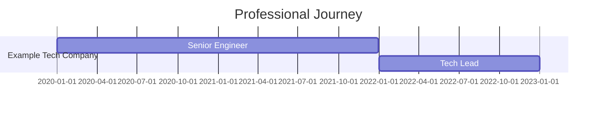

# Life Experiences Repository

This repository documents my professional journey as a technology professional, capturing experiences, projects, and learnings across different organizations and roles.

## Purpose

This is a structured, evidence-based portfolio that serves multiple purposes:

- 📚 **Knowledge Preservation**: Document projects, decisions, and learnings while they're fresh
- 📈 **Career Development**: Track growth, skills, and impact over time
- 🎯 **Portfolio Building**: Demonstrate capabilities with concrete evidence
- 🤝 **Knowledge Sharing**: Share experiences and learnings with the community
- 🔍 **Career Reflection**: Understand patterns, strengths, and areas for growth

## Repository Structure

```
life-experiences-repo/
├── README.md (this file)
├── organizations/          # Folder for each organization
│   ├── README.md          # Overview of all organizations
│   ├── [org-1]/           # Individual organization folder
│   │   ├── README.md      # Organization overview
│   │   ├── projects/      # Project documentation
│   │   ├── evidence/      # Evidence blocks (code, metrics, etc.)
│   │   └── assets/        # Supporting files (images, docs)
│   └── [org-2]/
│       └── ...
├── raw-inputs/            # Intake folder for raw data
│   ├── README.md          # Raw inputs guide
│   └── whatsapp-chats/    # WhatsApp chat exports
│       ├── unprocessed/   # New chats to be processed
│       ├── processed/     # Documented chats
│       └── media/         # Images and documents
└── templates/             # Templates for documentation
    ├── README.md          # Template guide
    ├── ORGANIZATION_README_TEMPLATE.md
    ├── PROJECT_TEMPLATE.md
    ├── EVIDENCE_TEMPLATE.md
    └── LESSONS_LEARNED_TEMPLATE.md
```

## Quick Navigation

### 📥 Raw Inputs

Dump your work-related content here for processing:

- [Raw Inputs Overview](raw-inputs/README.md) - How to use the intake folder
- [WhatsApp Chats](raw-inputs/whatsapp-chats/README.md) - *Drop chat exports here for Copilot to process*

### 📂 Organizations

View my experiences at different organizations:

- [Organizations Overview](organizations/README.md)
- [Example Tech Company](organizations/example-tech-company/README.md) - *Senior Software Engineer → Tech Lead (2020-Present)*

### 📋 Templates

Use these templates to create your own documentation:

- [Templates Guide](templates/README.md) - How to use the templates
- [Organization Template](templates/ORGANIZATION_README_TEMPLATE.md)
- [Project Template](templates/PROJECT_TEMPLATE.md)
- [Evidence Template](templates/EVIDENCE_TEMPLATE.md)
- [Lessons Learned Template](templates/LESSONS_LEARNED_TEMPLATE.md)

## Key Features

### 📊 Rich Documentation with Charts

All documentation supports Mermaid charts for visualizing:
- **Timelines**: Gantt charts showing project phases and career progression
- **Architectures**: System diagrams and data flow visualizations
- **Metrics**: Pie charts, graphs showing impact and growth
- **Relationships**: Team structures and component interactions

Example:


### 📝 Evidence-Based Documentation

Each claim is backed by evidence:
- **Code Samples**: Actual code demonstrating technical skills
- **Design Documents**: Architecture decisions and system designs
- **Metrics**: Quantifiable impact and outcomes
- **Certificates**: Professional certifications and awards

### 🎯 STAR Format

Evidence uses the STAR (Situation, Task, Action, Result) format:
- **Situation**: Context and background
- **Task**: What needed to be accomplished
- **Action**: What I specifically did
- **Result**: Outcomes and impact

## How to Use This Repository

### For Understanding My Journey

1. Start with [Organizations Overview](organizations/README.md)
2. Explore specific organizations of interest
3. Dive into individual projects for technical depth
4. Review evidence blocks for concrete examples

### For Technical Reference

- Browse project documentation for architecture patterns
- Review code samples for implementation examples
- Study design decisions and their rationale
- Learn from challenges and solutions

### For Career Insights

- See progression of roles and responsibilities
- Understand skill development over time
- Review impact metrics and achievements
- Learn from reflections and takeaways

### For Creating Your Own

1. Review the [Templates Guide](templates/README.md)
2. Copy templates for your own documentation
3. Follow the structure and best practices
4. Build your own professional portfolio

## Example Content

This repository includes example documentation to demonstrate the structure:

- **[Example Tech Company](organizations/example-tech-company/README.md)**: Complete organization documentation showing career progression from Senior Engineer to Tech Lead
- **[Real-Time Analytics Project](organizations/example-tech-company/projects/realtime-analytics.md)**: Detailed project documentation with architecture, timeline, and impact
- **[OAuth Implementation Evidence](organizations/example-tech-company/evidence/code-oauth-implementation.md)**: Code sample with context and impact analysis

## Documentation Principles

### 1. Comprehensive Yet Focused
- Document everything significant, but stay relevant
- Include context that matters for understanding
- Balance detail with readability

### 2. Evidence-Based
- Every claim backed by concrete evidence
- Use metrics and data when possible
- Link to artifacts and proof

### 3. Growth-Oriented
- Show progression and learning
- Document failures and lessons learned
- Connect experiences across time

### 4. Professional and Honest
- Accurate representation of contributions
- Give credit to team members
- Maintain confidentiality and professionalism

### 5. Future-Focused
- Document for your future self
- Help others learn from your experiences
- Build a foundation for career growth

## Getting Started

To start documenting your own journey:

1. **Fork or use as reference** - Use this repository as a template
2. **Start with one organization** - Don't try to document everything at once
3. **Use the templates** - They provide structure and best practices
4. **Be consistent** - Regular updates make documentation sustainable
5. **Focus on impact** - Always tie work to outcomes and learning

## Maintenance

This repository is actively maintained and updated:

- ✅ New projects added as they complete
- ✅ Evidence blocks added regularly
- ✅ Reflections updated quarterly
- ✅ Structure refined based on learnings

**Last Updated:** January 2026

## License

This repository structure and templates are available for anyone to use. Feel free to fork and adapt for your own professional documentation.

Personal experiences, code samples, and specific project details are shared for portfolio purposes. Please respect confidentiality and don't reuse proprietary information.

---

**Built with ❤️ to document and share the journey of a technology professional**
