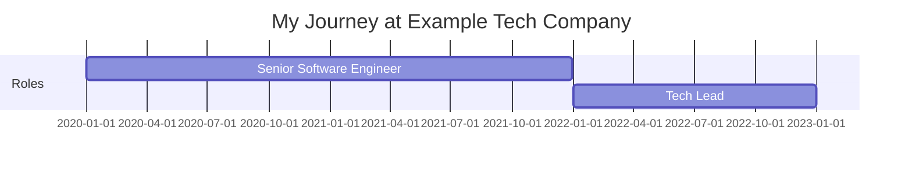
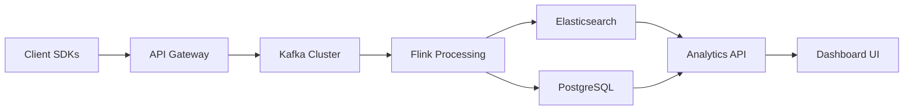
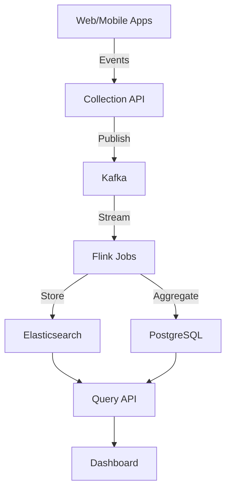
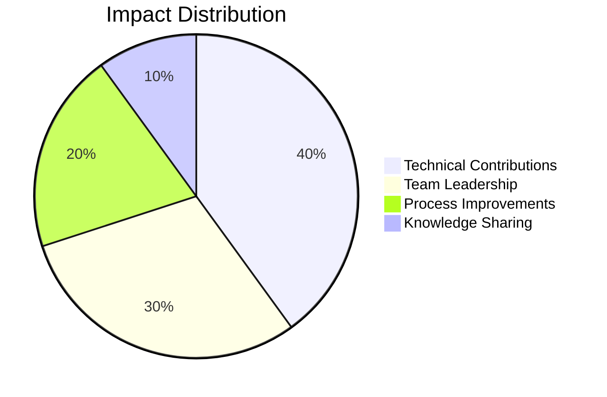

# Example Tech Company

## Overview

**Duration:** January 2020 - Present  
**Role(s):** Senior Software Engineer → Tech Lead  
**Location:** San Francisco, CA / Remote  
**Organization Type:** Technology Startup (Series B)

## Brief Description

Example Tech Company is a fast-growing SaaS platform that provides cloud-based analytics solutions for e-commerce businesses. The company helps online retailers optimize their customer experience through AI-powered insights and real-time data analysis.

---

## My Journey

### Timeline

### Key Milestones

- **January 2020**: Joined as Senior Software Engineer on the Platform team
- **June 2020**: Led migration of authentication system to OAuth 2.0
- **March 2021**: Promoted to founding member of Architecture Guild
- **January 2022**: Promoted to Tech Lead for Customer Analytics team
- **August 2022**: Launched real-time analytics feature used by 80% of customers

---

## Responsibilities & Contributions

### Technical Contributions

- **Authentication System Modernization**
  - Description: Migrated legacy authentication to OAuth 2.0 with SSO support
  - Technologies: Node.js, OAuth 2.0, Redis, PostgreSQL
  - Impact: Reduced authentication-related support tickets by 65%, enabled enterprise sales
  - Evidence: [Code Sample: OAuth Implementation](evidence/code-oauth-implementation.md)

- **Real-Time Analytics Pipeline**
  - Description: Built scalable real-time data processing pipeline
  - Technologies: Apache Kafka, Apache Flink, Elasticsearch, React
  - Impact: Processes 10M+ events/day with <500ms latency, drove $2M+ in new revenue
  - Evidence: [Architecture Design](evidence/design-realtime-analytics.md)

- **Microservices Architecture Migration**
  - Description: Led decomposition of monolith into microservices
  - Technologies: Docker, Kubernetes, gRPC, Service Mesh
  - Impact: Improved deployment frequency by 10x, reduced incident response time by 40%
  - Evidence: [Migration Metrics](evidence/metrics-microservices-migration.md)

### Socio-Technical Contributions

- **Architecture Guild Founding Member**
  - Description: Established cross-team architecture review process
  - Stakeholders: Engineering leadership, all engineering teams
  - Impact: Standardized technology decisions, improved system consistency
  - Evidence: [Architecture Decision Records](evidence/adr-process.md)

- **Engineering Mentorship Program**
  - Description: Created and led mentorship program for junior engineers
  - Stakeholders: 12 mentees across 4 teams
  - Impact: 100% retention rate, 3 promotions within first year
  - Evidence: [Program Metrics](evidence/mentorship-impact.md)

---

## Skills Developed

### Technical Skills

| Skill | Proficiency Level | Evidence |
|-------|-------------------|----------|
| System Design | Expert | [Real-time Analytics Architecture](evidence/design-realtime-analytics.md) |
| Microservices | Advanced | [Migration Case Study](evidence/metrics-microservices-migration.md) |
| Apache Kafka | Advanced | [Streaming Pipeline Implementation](projects/realtime-analytics.md) |
| Kubernetes | Intermediate | [K8s Migration](evidence/k8s-deployment.md) |
| OAuth/Security | Advanced | [OAuth Implementation](evidence/code-oauth-implementation.md) |

### Soft Skills

| Skill | Description | Evidence |
|-------|-------------|----------|
| Technical Leadership | Led team of 6 engineers, drove technical vision | [Tech Lead Retrospective](evidence/tech-lead-impact.md) |
| Mentorship | Mentored 12 engineers, created mentorship program | [Mentorship Metrics](evidence/mentorship-impact.md) |
| Cross-team Collaboration | Founded Architecture Guild, coordinated across 8 teams | [Architecture Guild](evidence/adr-process.md) |
| Stakeholder Management | Presented to C-suite, managed expectations with product | [Quarterly Reviews](evidence/stakeholder-presentations.md) |

---

## Evidence Blocks

### Evidence: OAuth 2.0 Implementation

**Type:** Code Sample  
**Date:** June 2020  
**Description:** Modern authentication system with OAuth 2.0, supporting multiple identity providers

View Evidence

This implementation demonstrates secure authentication patterns, token management, and integration with multiple identity providers.

**Key Features:**
- Multi-provider OAuth support (Google, GitHub, Okta)
- Secure token storage and refresh
- Rate limiting and abuse prevention
- Comprehensive audit logging

**Impact:**
- 99.99% authentication uptime
- Zero security incidents
- 65% reduction in auth-related support tickets

### Evidence: Real-time Analytics Architecture

**Type:** Design Document  
**Date:** March 2022  
**Description:** Scalable architecture for processing millions of events per day

View Architecture

**Design Highlights:**
- Event-driven architecture for real-time processing
- Horizontal scalability at every layer
- Fault-tolerant with exactly-once semantics
- Sub-500ms end-to-end latency

---

## Projects & Initiatives

### Real-Time Analytics Platform

**Duration:** January 2022 - August 2022  
**Role:** Tech Lead  
**Team Size:** 6 engineers

#### Overview
Built a real-time analytics platform that processes customer behavioral data and provides instant insights. The platform handles 10M+ events per day and serves dashboards to thousands of users.

[View Full Project Documentation](projects/realtime-analytics.md)

#### Technical Architecture

#### Outcomes & Impact

- Processes 10M+ events/day with <500ms latency
- Powers dashboards used by 80% of customers
- Generated $2M+ in new revenue in first 6 months
- 99.95% uptime since launch

#### Key Learnings

1. Start with clear SLAs and work backwards to architecture
2. Invest in observability from day one
3. Stream processing requires different testing strategies than batch

### Authentication System Modernization

**Duration:** April 2020 - June 2020  
**Role:** Technical Lead  
**Team Size:** 3 engineers

[View Full Project Documentation](projects/auth-modernization.md)

### Microservices Migration

**Duration:** September 2021 - March 2022  
**Role:** Technical Lead  
**Team Size:** 8 engineers (across teams)

[View Full Project Documentation](projects/microservices-migration.md)

---

## Reflections

### What Went Well

- **Technical Growth**: Grew from implementing features to designing systems and leading teams
- **Impact Focus**: Every major project had clear business impact and measurable outcomes
- **Collaboration**: Built strong relationships across engineering, product, and leadership
- **Mentorship**: Found joy in helping others grow and seeing their success

### Challenges Overcome

- **Scaling Challenges**: Learned to design systems for 10x growth, not just current needs
- **Technical Debt**: Balanced feature velocity with architecture improvements
- **Team Dynamics**: Navigated team changes and helped onboard new members effectively
- **Remote Transition**: Successfully led team through remote transition during COVID-19

### Key Takeaways

1. **Architecture matters**: Good architecture enables velocity; bad architecture kills it
2. **People first**: The best technical solution means nothing without team buy-in
3. **Measure everything**: Data-driven decisions lead to better outcomes
4. **Communication is key**: Technical leadership is 50% technical, 50% communication
5. **Continuous learning**: Technology changes fast; staying curious is essential

---

## Metrics & Impact

### Quantifiable Achievements

- **System Performance**: Improved average API response time by 60% (800ms → 320ms)
- **Deployment Velocity**: Increased deployment frequency from weekly to daily (10x improvement)
- **Revenue Impact**: Technical contributions directly enabled $5M+ in new revenue
- **Team Growth**: Grew team from 4 to 10 engineers while maintaining velocity
- **Code Quality**: Reduced production incidents by 45% through better testing and monitoring
- **Customer Satisfaction**: Engineering improvements contributed to NPS increase from 35 to 58

---

## Artifacts & Links

- **Tech Blog Posts:**
  - [Building Real-Time Analytics at Scale](https://blog.example.com/realtime-analytics)
  - [Lessons from Microservices Migration](https://blog.example.com/microservices-lessons)

- **Conference Talks:**
  - [ReactConf 2022: Real-Time Dashboards with React and Kafka](https://example.com/talks/reactconf)

- **Open Source Contributions:**
  - [Contributed Kafka connector for analytics](https://github.com/example/kafka-connector)

---

## Related Experiences

- Previous experience with distributed systems at [Previous Company](../previous-company/README.md)
- Consulting work on analytics platforms at [Consulting Project](../consulting-projects/analytics-consulting.md)
