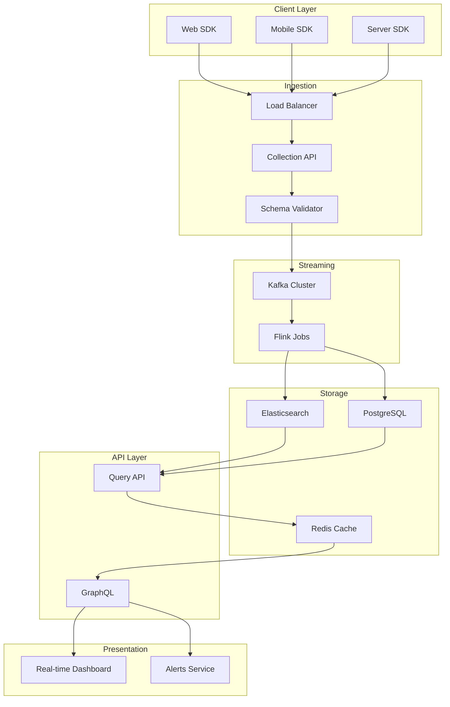
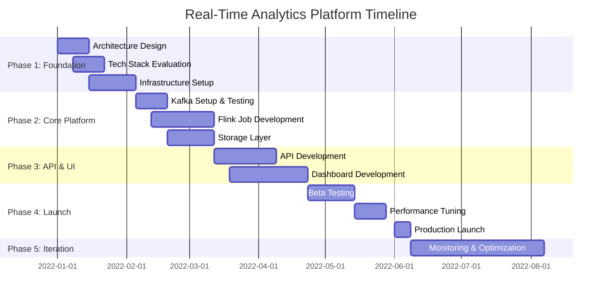
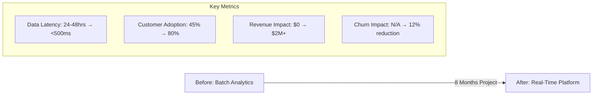
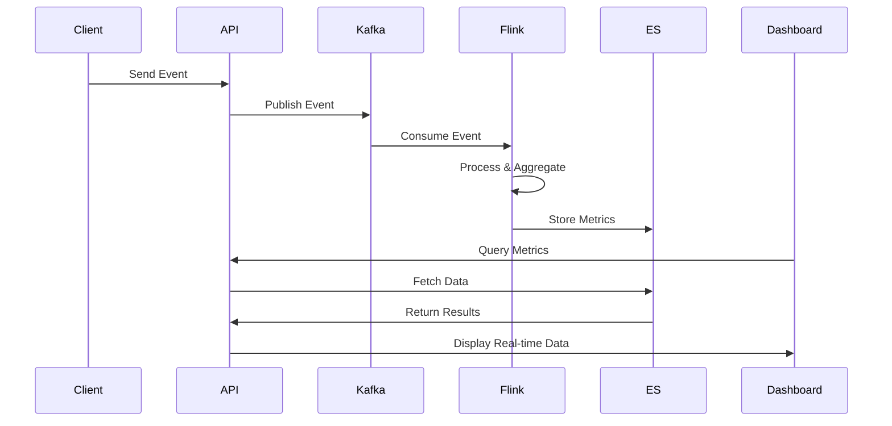
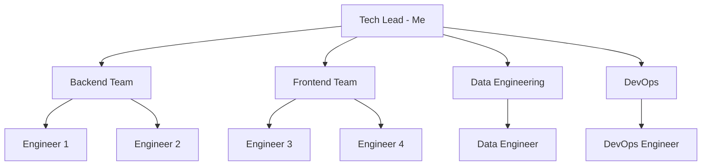

# Real-Time Analytics Platform

## Metadata

**Organization:** [Example Tech Company](../README.md)  
**Duration:** January 2022 - August 2022  
**Role:** Tech Lead  
**Team Size:** 6 engineers (2 backend, 2 frontend, 1 data engineer, 1 DevOps)  
**Status:** Completed and in Production

---

## Executive Summary

The Real-Time Analytics Platform was a strategic initiative to transform our batch-based analytics into a real-time system. The project delivered a scalable platform capable of processing 10+ million events per day with sub-500ms latency, providing customers with instant insights into their e-commerce performance. 

The platform has become a key differentiator, used by 80% of customers and generating over $2M in new revenue within the first six months of launch. The system maintains 99.95% uptime and has handled peak loads of 15M events/day during major shopping events.

---

## Problem Statement

### Background
Customers were receiving analytics reports with 24-48 hour delays, making it difficult to respond to real-time customer behavior or identify issues quickly. Our batch processing system ran overnight, meaning any trends or problems wouldn't be visible until the next day.

### Business Challenge
- **Competitive Disadvantage**: Competitors offered real-time insights
- **Customer Churn Risk**: 23% of churned customers cited "slow insights" as a reason
- **Revenue Opportunity**: Enterprise customers willing to pay 2-3x for real-time features
- **Black Friday Problem**: Unable to provide insights during peak shopping periods

### Technical Challenge
- **Scale**: Need to process 10M+ events/day (15M+ during peaks)
- **Latency**: Must deliver insights in under 500ms end-to-end
- **Reliability**: 99.9% uptime requirement for enterprise SLA
- **Cost**: Must stay within 30% cost increase vs batch system
- **Backward Compatibility**: Can't break existing analytics features

---

## Solution

### Approach
We adopted an event-driven architecture using Apache Kafka for ingestion, Apache Flink for stream processing, and a hybrid storage strategy (Elasticsearch for real-time queries, PostgreSQL for aggregations). The platform was built incrementally, starting with a pilot for one metric type and expanding to full coverage.

### Architecture



### Technology Stack

| Category | Technologies |
|----------|--------------|
| Frontend | React, Redux, Recharts, WebSocket |
| Backend | Node.js, Express, GraphQL |
| Streaming | Apache Kafka, Apache Flink, Kafka Connect |
| Storage | Elasticsearch 7.x, PostgreSQL 13, Redis |
| Infrastructure | Kubernetes, Helm, AWS (EKS, MSK, RDS) |
| Monitoring | Prometheus, Grafana, ELK Stack, Sentry |
| Tools & Services | Docker, Terraform, GitHub Actions, Datadog |

---

## My Contributions

### Technical Contributions

#### Architecture & Design
- Designed the overall system architecture and data flow
- Defined event schema and versioning strategy
- Created performance benchmarks and SLA requirements
- Designed fault tolerance and recovery mechanisms

#### Stream Processing
- Implemented core Flink jobs for event processing
- Built windowing logic for time-based aggregations
- Created exactly-once semantics for critical metrics
- Optimized watermark strategies for late-arriving events

#### API Development
- Built GraphQL API for real-time metric queries
- Implemented query optimization and caching layer
- Created WebSocket server for live dashboard updates
- Designed rate limiting and quota management

### Leadership & Collaboration
- Led technical planning and sprint execution
- Mentored 2 engineers on stream processing concepts
- Coordinated with Product on feature prioritization
- Presented architecture to C-suite for funding approval
- Managed relationships with infrastructure team for Kafka setup

---

## Implementation Timeline



### Key Milestones

- **January 15, 2022**: Architecture approved by engineering leadership
- **February 5, 2022**: Kafka cluster deployed and load tested
- **March 12, 2022**: First Flink job processing live traffic
- **April 1, 2022**: Beta dashboard live with 10 pilot customers
- **June 1, 2022**: Public launch to all customers
- **August 1, 2022**: Achieved 80% customer adoption

---

## Outcomes & Impact

### Business Impact
- **Revenue**: Generated $2M+ in new revenue in first 6 months
- **Customer Adoption**: 80% of customers actively using real-time features
- **Churn Reduction**: Cited in 12% reduction in customer churn
- **Enterprise Sales**: Enabled 5 major enterprise deals worth $3M+ combined
- **Competitive Edge**: Featured in marketing as key differentiator

### Technical Impact
- **Performance**: Consistent <500ms p95 latency for all queries
- **Scale**: Successfully processing 10-15M events/day
- **Reliability**: 99.95% uptime since launch (exceeding 99.9% SLA)
- **Cost Efficiency**: 25% cost increase vs batch (under 30% target)
- **Engineering Velocity**: Enabled 3 follow-on real-time features

### User Impact
- **Immediate Insights**: Customers see data within seconds vs 24-48 hours
- **Better Decisions**: Real-time alerts prevent revenue loss
- **Enhanced Experience**: Dashboard rated 4.8/5 stars by users
- **Trust Building**: Customers trust data more when it's current

### Metrics



---

## Technical Deep Dive

### Event Processing Pipeline

**Purpose:** Ingest, validate, and process millions of events per day with exactly-once semantics

**Implementation:**

```javascript
// Flink Job for Page View Aggregation
const flinkJob = env
  .addSource(new FlinkKafkaConsumer('page-views', schema, kafkaProps))
  .assignTimestampsAndWatermarks(
    WatermarkStrategy
      .forBoundedOutOfOrderness(Duration.ofSeconds(10))
      .withTimestampAssigner((event) => event.timestamp)
  )
  .keyBy(event => `${event.customerId}:${event.pageUrl}`)
  .window(TumblingEventTimeWindows.of(Time.minutes(1)))
  .aggregate(new PageViewAggregator())
  .addSink(new ElasticsearchSink(esConfig));

// Custom Aggregator
class PageViewAggregator implements AggregateFunction {
  createAccumulator() {
    return { count: 0, uniqueUsers: new Set(), avgDuration: 0 };
  }
  
  add(event, accumulator) {
    return {
      count: accumulator.count + 1,
      uniqueUsers: accumulator.uniqueUsers.add(event.userId),
      avgDuration: (accumulator.avgDuration * accumulator.count + event.duration) 
                   / (accumulator.count + 1)
    };
  }
  
  getResult(accumulator) {
    return {
      pageViews: accumulator.count,
      uniqueVisitors: accumulator.uniqueUsers.size,
      avgDuration: Math.round(accumulator.avgDuration)
    };
  }
}
```

**Key Decisions:**
- Used event time semantics with 10s out-of-order tolerance for accuracy
- Chose 1-minute tumbling windows for balance of latency and resource usage
- Implemented custom aggregators for complex metrics vs multiple jobs
- Added idempotent sinks to handle Flink retries without double-counting

### WebSocket Live Updates

**Purpose:** Push real-time updates to dashboards without client polling

**Implementation:**

```javascript
// WebSocket Server with Redis Pub/Sub
class RealtimeServer {
  constructor() {
    this.wss = new WebSocket.Server({ port: 8080 });
    this.redis = new Redis();
    this.subscriptions = new Map();
  }
  
  handleConnection(ws, request) {
    const customerId = this.authenticate(request);
    
    ws.on('message', (message) => {
      const { action, metrics } = JSON.parse(message);
      
      if (action === 'subscribe') {
        this.subscribe(customerId, metrics, ws);
      }
    });
    
    ws.on('close', () => {
      this.unsubscribe(ws);
    });
  }
  
  subscribe(customerId, metrics, ws) {
    const channel = `metrics:${customerId}`;
    
    if (!this.subscriptions.has(channel)) {
      this.redis.subscribe(channel);
      this.redis.on('message', (ch, message) => {
        this.broadcast(ch, JSON.parse(message));
      });
    }
    
    this.subscriptions.set(ws, { channel, metrics });
  }
  
  broadcast(channel, data) {
    this.wss.clients.forEach(client => {
      const sub = this.subscriptions.get(client);
      if (sub && sub.channel === channel) {
        client.send(JSON.stringify(data));
      }
    });
  }
}
```

**Key Decisions:**
- Redis Pub/Sub for scalable message distribution vs direct WebSocket
- Client-side metric filtering to reduce server load
- Heartbeat mechanism to detect stale connections
- Automatic reconnection logic with exponential backoff

---

## Challenges & Solutions

| Challenge | Solution | Outcome |
|-----------|----------|---------|
| Late-arriving events causing incorrect aggregations | Implemented watermarks with 10s out-of-order tolerance + late event side output | <0.01% data loss, increased accuracy |
| Elasticsearch query performance degraded with data growth | Added time-based indices + query result caching in Redis | 80% reduction in query latency |
| Flink state size growing unbounded | Implemented state TTL + periodic compaction | Reduced state size by 60% |
| Kafka consumer lag during traffic spikes | Auto-scaling Flink task managers + increased parallelism | Zero consumer lag even at 15M events/day |
| Dashboard rendering slow with real-time updates | Implemented virtual scrolling + update throttling | Smooth 60fps rendering |

---

## Learnings & Growth

### Technical Learnings
1. **Stream Processing != Batch**: Different mental model required for event time, watermarks, and windowing
2. **Exactly-Once is Hard**: Requires coordination between sources, processing, and sinks
3. **Observability is Critical**: You can't troubleshoot stream processing without great observability
4. **Start Simple**: Begin with stateless operations before tackling complex stateful processing

### Process Learnings
1. **Incremental Delivery**: Beta with pilot customers de-risked the launch
2. **SLA-Driven Design**: Starting with SLAs forced architectural decisions upfront
3. **Cross-Team Coordination**: Early infrastructure engagement prevented delays
4. **Documentation Matters**: Runbooks saved us during 3am incidents

### Personal Growth
1. **Technical Leadership**: First time leading a project of this complexity and visibility
2. **Stakeholder Management**: Learned to communicate technical tradeoffs to non-technical executives
3. **Mentorship**: Teaching stream processing concepts deepened my own understanding
4. **Pressure Management**: Stayed calm during production incidents and made good decisions

---

## Evidence

### Code Samples

<details>
<summary>View Code Sample: Flink Aggregation Logic</summary>

```java
public class PageViewAggregator 
    implements AggregateFunction<PageViewEvent, PageViewAccumulator, PageViewMetrics> {
    
    @Override
    public PageViewAccumulator createAccumulator() {
        return new PageViewAccumulator();
    }
    
    @Override
    public PageViewAccumulator add(PageViewEvent event, PageViewAccumulator acc) {
        acc.incrementCount();
        acc.addUser(event.getUserId());
        acc.addDuration(event.getDuration());
        acc.updateTimestamp(event.getTimestamp());
        return acc;
    }
    
    @Override
    public PageViewMetrics getResult(PageViewAccumulator acc) {
        return PageViewMetrics.builder()
            .pageViews(acc.getCount())
            .uniqueVisitors(acc.getUniqueUsers())
            .avgDuration(acc.getAvgDuration())
            .timestamp(acc.getLatestTimestamp())
            .build();
    }
    
    @Override
    public PageViewAccumulator merge(PageViewAccumulator a, PageViewAccumulator b) {
        a.merge(b);
        return a;
    }
}
```

</details>

### Architecture Diagrams

**Data Flow Architecture:**



### Performance Metrics

**Latency Distribution (P50, P95, P99):**

- P50: 180ms
- P95: 420ms
- P99: 650ms
- Max: 980ms (still under 1s SLA)

**Throughput Capacity:**

- Average: 10M events/day
- Peak: 15M events/day
- Per second: 115-173 events/sec

---

## Team & Collaboration

### Team Structure



### My Role in Team Dynamics
As Tech Lead, I was responsible for:
- Defining technical direction and making architectural decisions
- Unblocking engineers and solving complex technical challenges
- Code reviews and ensuring quality standards
- Daily standups and sprint planning
- Mentoring junior engineers on stream processing concepts

### Cross-functional Collaboration
- **Product Team**: Weekly syncs on feature prioritization and user feedback
- **Infrastructure Team**: Kafka cluster sizing and monitoring setup
- **Customer Success**: Beta program coordination and feedback collection
- **Sales/Marketing**: Technical presentations for enterprise deals

---

## Future Considerations

### What I Would Do Differently
- **Earlier Load Testing**: We found some bottlenecks late; should have load tested earlier
- **More Gradual Rollout**: Could have rolled out to customers more gradually vs big bang
- **Better Documentation**: Should have written more runbooks during development, not after
- **Automated Testing**: Stream processing testing was manual initially; should have automated sooner

### Potential Enhancements
- **Machine Learning Integration**: Real-time anomaly detection and predictions
- **Multi-Region Support**: Deploy in multiple regions for lower latency globally
- **Event Replay**: Ability to replay historical events for debugging or reprocessing
- **Custom Metrics**: Allow customers to define their own real-time metrics
- **Advanced Visualizations**: More sophisticated chart types and data exploration

---

## Related Projects
- [Authentication System Modernization](auth-modernization.md) - Shared infrastructure patterns
- [Microservices Migration](microservices-migration.md) - Platform services decomposition
- [Customer Dashboard Redesign](#) - Integrated real-time features into existing UI
