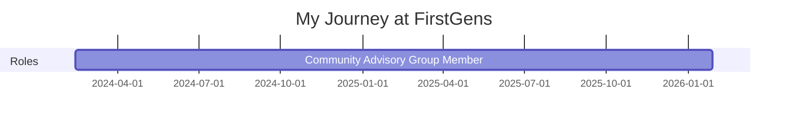

# FirstGens

## Overview

**Duration:** February 2024 - Present  
**Role(s):** Community Advisory Group Member  
**Location:** UK / Remote  
**Organization Type:** Social Enterprise (Royal Award-Winning)

## Brief Description

FirstGens is a royal award-winning social enterprise that supports undergraduates who are the first generation in their family to attend university. The organization helps reduce progression gaps across access, attainment, completion, and graduate destinations for first-generation students.

---

## My Journey

### Timeline

### Key Milestones

- **February 2024**: Joined the Community Advisory Group
- **February-March 2024**: Contributed ideas for UCAS first-generation students page
- **May 2024**: Participated in the inaugural online sector event (200+ registrations)
- **June 2024**: UCAS page for first-generation students launched with my contributions
- **June 2024**: Expressed interest in Sutton Trust webinar collaboration

---

## Responsibilities & Contributions

### Strategic Contributions

- **UCAS First-Generation Students Page**
  - Description: Contributed strategic ideas for creating a dedicated UCAS resource page for first-generation students
  - Stakeholders: UCAS, FirstGens, prospective first-generation students
  - Impact: Page launched June 2024 - first national resource of its kind on UCAS
  - Evidence: [UCAS Page Contribution](evidence/ucas-page-contribution.md)

### Technical & Design Contributions

- **Website Feedback**
  - Description: Provided detailed UX/UI feedback on FirstGens' new website launch (Sanity CMS migration)
  - Technologies: CMS Analysis, UX/UI Evaluation
  - Impact: Helped refine the visual design and content management approach
  - Evidence: [Website Feedback](evidence/website-feedback.md)

### Community & Collaboration

- **Sector Event Participation**
  - Description: Attended and contributed to the first national conference on first-generation students
  - Stakeholders: Universities UK, CASE, Million Plus, Wonkhe, Russell Group
  - Impact: Event achieved 200+ registrations, promoted first-gen student awareness
  - Evidence: [Sector Event](evidence/sector-event.md)

---

## Skills Demonstrated

### Technical Skills

| Skill | Proficiency Level | Evidence |
|-------|-------------------|----------|
| Strategic Thinking | Advanced | UCAS page ideation and contribution |
| Stakeholder Engagement | Intermediate | Advisory group collaboration |
| Community Building | Advanced | Advisory group participation |
| UX/UI Analysis | Advanced | Website feedback and recommendations |
| Accessibility | Advanced | UCAS page accessibility suggestions |
| Content Strategy | Intermediate | Resource page recommendations |

---

## Key Discussions & Decisions

### UCAS Page Content Strategy

Key suggestions contributed to the UCAS first-generation students page:

1. **Alumni Testimonials with Collapsible Profiles** - Featuring current first-generation students from diverse degree programs
2. **Imposter Syndrome Guidance** - Tips on building self-confidence as an underrepresented student
3. **Financial Literacy Resources** - Budgeting advice and information on scholarships/bursaries specifically for first-gen students
4. **Parent/Family Resources** - Downloadable guides to help family members understand the university process
5. **Practical Application Tips** - Case studies reflecting first-gen students' journeys with obstacles

### Advisory Group Collaboration

Worked alongside other advisory group members including:
- Nathaniel Guerreiro (LSE, Law)
- Ayoola Johnson (University of Manchester, WP)
- Sahra (University of Reading, SEO London)
- Emilija Marčinskaitė (Leeds Psychology graduate)
- Chloe Smith (Sociology/Law, Octopus Energy)
- Megan Lambert (Newcastle graduate, Programme Coordinator)

---

## Impact & Achievements

### Quantifiable Results

- **UCAS Page Launch**: Contributed to the creation of the first national UCAS resource for first-generation students
- **Event Success**: Supported event that achieved 200+ registrations from university sector professionals
- **Network Effect**: Mass email outreach to university key figures promoting the sector event

### Qualitative Outcomes

- Established as a trusted voice in the first-generation student support community
- Contributed to strategic direction of a royal award-winning social enterprise
- Built relationships with sector professionals and other advisory members

---

## Reflections

### What Went Well

- Strong alignment with FirstGens' mission as a first-generation student myself
- Ability to provide authentic, lived-experience insights
- Effective collaboration with diverse advisory group members

### Challenges Faced

- Balancing advisory group commitments with other responsibilities
- Coordinating asynchronously across different schedules and time zones

### Key Takeaways

1. **Lived experience is valuable**: Personal journey as a first-gen student provided authentic insights
2. **Collective wisdom amplifies impact**: Advisory group's diverse perspectives created stronger outcomes
3. **Small contributions compound**: Individual ideas contributed to a significant national resource

---

## Related Documentation

- **Evidence**: [UCAS Page Contribution](evidence/ucas-page-contribution.md)

---

## Artifacts & Links

- **UCAS First-Generation Students Page**: [https://www.ucas.com/undergraduate/what-and-where-study/what-can-i-do-next/students-individual-needs/first-generation-students](https://www.ucas.com/undergraduate/what-and-where-study/what-can-i-do-next/students-individual-needs/first-generation-students)
- **FirstGens Website**: [https://www.firstgens.co.uk](https://www.firstgens.co.uk)
- **Related Blog Post**: [Building Self-Confidence at University](https://www.firstgens.co.uk/firstgen-blog/building-self-confidence-at-university)

---

**Source**: `raw-inputs/whatsapp-chats/unprocessed/2025_firstgens-advisory-group_group-chat.txt`  
**Processed on**: 2026-01-28
