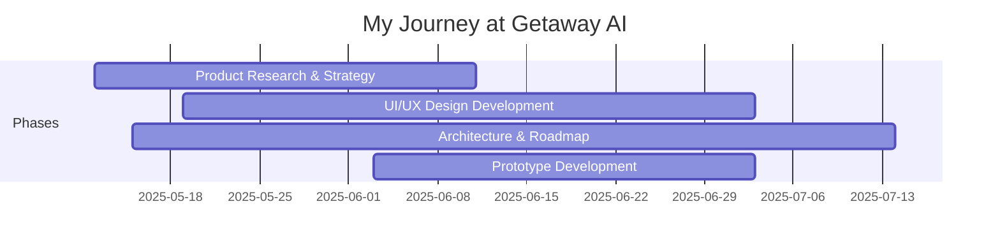

# Getaway AI

## Overview

**Duration:** May 2025 - Present  
**Role(s):** Co-Founder / Product Designer / UX Lead  
**Location:** UK / Remote  
**Organization Type:** AI Travel Tech Startup

## Brief Description

Getaway AI is an AI-powered group trip planning application that uses agentic AI to simplify the process of planning trips with friends. The app takes individual preferences, budgets, and available dates from group members and provides personalized trip recommendations using smart algorithms and AI agents that interact with travel APIs.

---

## My Journey

### Timeline

### Key Milestones

- **May 2025**: Joined Getaway co-founders team
- **May 2025**: Began deep research into AI agent architectures and travel domain
- **May 2025**: Started contributing to product roadmap and technical strategy
- **June 2025**: Presented UI/UX design prototype to team
- **June 2025**: Contributed to domain name purchase (getawayai.app)
- **June 2025**: Developed animated splash screen prototype

---

## Responsibilities & Contributions

### Product Strategy & Research

- **AI Architecture Research**
  - Description: Deep research into agentic AI patterns, MCP protocols, and tool-calling architectures
  - Focus: Informing technical decisions for the AI travel planning agent
  - Impact: Provided strategic direction for the agent's architecture
  - Evidence: [AI Research](evidence/ai-architecture-research.md)

- **Competitive & Market Research**
  - Description: Analysis of competing solutions, market opportunities, and moat strategy
  - Focus: Identifying unique value propositions and sustainable competitive advantages
  - Impact: Shaped product positioning and differentiation strategy
  - Evidence: [Market Research](evidence/market-research.md)

### UI/UX Design

- **Interface Design**
  - Description: Designing the user interface and experience for the Getaway app
  - Technologies: Figma, Lovable, Motion design
  - Impact: Creating the visual identity and user flows
  - Evidence: [UI/UX Design](evidence/ui-ux-design.md)

- **Splash Screen & Animation**
  - Description: Designed and developed an animated splash screen with particle effects
  - Technologies: Canvas-based rendering, motion graphics
  - Impact: Creating memorable first impression and brand storytelling
  - Evidence: [Animation Design](evidence/splash-animation.md)

### Technical Advisory

- **Tool Integration Research**
  - Description: Researching tools like Firecrawl, Laminar, Bright Data, Pica for the travel agent
  - Focus: Identifying tools to enhance the AI agent's capabilities
  - Impact: Expanding the agent's ability to access travel data
  - Evidence: [Tool Research](evidence/tool-integration.md)

---

## Skills Demonstrated

### Technical Skills

| Skill | Proficiency Level | Evidence |
|-------|-------------------|----------|
| Product Strategy | Advanced | Roadmap development and moat strategy |
| UI/UX Design | Advanced | Interface design and prototyping |
| AI/ML Concepts | Intermediate | Agent architecture research |
| Motion Design | Intermediate | Animated splash screen development |

### Soft Skills

| Skill | Proficiency Level | Evidence |
|-------|-------------------|----------|
| Strategic Thinking | Advanced | Competitive analysis and positioning |
| Research & Synthesis | Expert | Deep technical research and documentation |
| Communication | Advanced | Clear documentation and presentation of ideas |
| Collaboration | Advanced | Working with technical co-founders |

---

## Key Contributions

### AI Agent Architecture Strategy

Provided extensive research and strategic input on:

1. **Agentic AI Patterns**: Research on headless agents, MCP protocols, and tool-calling architectures
2. **Moat Strategy**: Analysis of how to build sustainable competitive advantages
3. **Tool Selection**: Evaluation of tools like Firecrawl, Laminar, Bright Data for enhancing agent capabilities

> "The value is in the wrapper. What gets us customers is not only the ease of planning, but also taste. We need to focus incessantly on those two things"
> — Fizzy, responding to my strategic input

### Product Naming & Positioning

Contributed to defining the product identity:

> "GetAway Travel Agent Gateway" - A descriptive name for the software architecture:
> - **Gateway**: Single, standardised entry point to diverse travel APIs
> - **Agent**: Primary consumer is the AI agent
> - **Travel**: Specialized for the travel domain

### UI/UX Design Philosophy

Championed cognitive-load-aware design:

> "Visual hierarchy is so paramount; not just in web copy with H1, H2, H3, paragraphs, and titles, but also in interface design. Proper hierarchy helps users focus by organising information in a clear, digestible way."

> "Making the map overlays optional via a toggle respects these cognitive limits, reducing initial complexity and avoiding sensory overload for first-time users."

### Splash Screen Design

Developed brand storytelling through animation:

> "Brand storytelling through visual metaphor (big bang kind of chaos signifies new genesis then → order which is the calm after the storm → here comes travel planning the Getaway way)"

Technical specification:
- 0-3000ms: Particle chaos → airplane formation
- 3500ms: "GETAWAY" emergence with glow effect
- 4300ms: Tagline revelation
- 5300ms+: Stable state with interactive particles
- 6000-8000ms: Transition to main app interface

---

## Research & Documentation

### Tools & Technologies Evaluated

| Tool | Purpose | Status |
|------|---------|--------|
| Firecrawl | Web scraping for travel data | Recommended |
| Laminar | Agent tracing and debugging | Recommended |
| Bright Data | Web data access platform | Under evaluation |
| Pica | API connector framework | Under evaluation |
| MCP (Model Context Protocol) | Agent-tool communication | Strategic priority |

### Strategic Insights Contributed

1. **Fine-tuning vs. Generic Models**: Smaller specialist models may outperform larger generalist models for travel-specific tasks
2. **IP Protection**: Need for proper NDAs and legal framework among co-founders
3. **Accelerator Strategy**: Opportunities for pre-product accelerator applications
4. **Data Monetization**: Potential for aggregated travel insights as secondary revenue stream

---

## Team & Collaboration

### Co-Founders

- **Fizzy (Afifoluwa Akinyemi)**: Technical Lead / Backend Developer - Building the AI agent
- **Jo (Joseph)**: Backend Developer - Contributing to agent development
- **Andie (Me)**: Product Designer / UX Lead - Design, strategy, and research

### Working Rhythm

- **Sprint Planning**: Bi-weekly sprints with Monday planning sessions
- **Daily Standups**: Updates shared via WhatsApp group
- **Collab Rooms**: Google Meet rooms open for co-working sessions (4:30pm - midnight)
- **Documentation**: Jira for task management, Miro for flowcharts and collaboration

---

## Impact Summary

### Contributions Made

- **Research Documentation**: Extensive research on AI agents, tools, and architecture patterns
- **Design Deliverables**: UI/UX prototype, splash screen animation, design system foundations
- **Strategic Input**: Moat strategy, competitive analysis, product positioning
- **Tool Recommendations**: Firecrawl, Laminar, and other tools for enhancing agent capabilities

### Prototype Deliverable

Created high-fidelity prototype: [https://getaway-ai-voyage-planner.lovable.app/](https://getaway-ai-voyage-planner.lovable.app/)

---

## Reflections

### What Went Well

- Strong research capabilities contributed to strategic direction
- Design work progressing well with positive team feedback
- Collaborative working relationship with co-founders
- Regular communication and transparency about availability

### Challenges Faced

- Balancing startup work with full-time employment
- Managing personal responsibilities (caring for mother after heart attack)
- Coordinating across different schedules and availability windows

### Key Takeaways

1. **Research creates strategic clarity**: Deep research on AI architectures informed better product decisions
2. **Design thinking scales**: UI/UX principles from professional experience transfer to startup context
3. **Communication is foundation**: Transparent communication about capacity builds trust
4. **Value compounds over time**: Consistent contributions, even if fractional, add up to meaningful impact

---

## Quotes & Evidence

> "Thanks, I'll look into it. It'll be good to have Airbnb accommodations on Getaway, but they don't have an external API"
> — Fizzy, responding to Firecrawl research

> "Thank you for the resources @Andie. I'll have a look at each one of them."
> — Fizzy, on AI architecture research

> "Thanks. This looks good so far."
> — Fizzy, on UI/UX prototype

> "This would be fantastic. Good thinking"
> — Jo, on NDA automation suggestion

---

## Related Documentation

- **Evidence**: [AI Research](evidence/ai-architecture-research.md)
- **Evidence**: [UI/UX Design](evidence/ui-ux-design.md)
- **Projects**: [Product Roadmap](projects/product-roadmap.md)

---

## Artifacts & Links

- **Domain**: [getawayai.app](https://getawayai.app)
- **Google Play**: [Getaway App](https://play.google.com/store/apps/details?id=com.fifolua.getaway)
- **Jira Board**: [Getaway Frontend](https://getawayai.atlassian.net/jira/software/projects/SCRUM/boards/1)
- **Miro Board**: [Architecture Flowchart](https://miro.com/app/board/uXjVI2tNOyQ=/)
- **Prototype**: [Lovable App](https://getaway-ai-voyage-planner.lovable.app/)

---

**Source**: `raw-inputs/whatsapp-chats/unprocessed/2025_getaway-cofounders_team-chat.txt`  
**Processed on**: 2026-01-28
