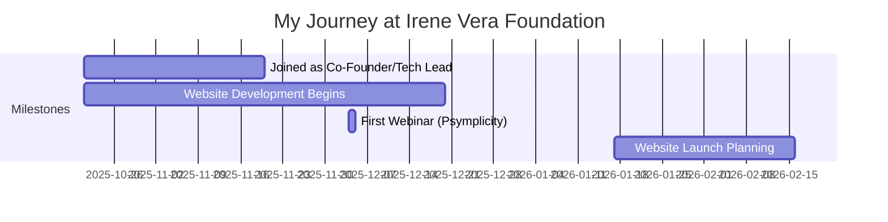

# Irene Vera Foundation (IVF)

## Overview

**Duration:** October 2025 - Present  
**Role(s):** Co-Founder / Website Developer  
**Location:** UK / Remote  
**Organization Type:** UK-Registered Charity

## Brief Description

The Irene Vera Foundation is a UK-registered charity working to advance education among young people in both Zimbabwe and the UK, especially those who are:
- Socially or economically disadvantaged
- Neurodivergent (including ADHD, autism, or dyslexia)
- Living with physical disabilities

The charity provides resources, support, and opportunities, promotes inclusive learning environments, and offers educational grants and materials to those in need.

---

## My Journey

### Timeline

### Key Milestones

- **October 2025**: Joined IVF co-founders team to lead website development
- **October 2025**: Provided UI/UX accessibility feedback on event flyers
- **November 2025**: Contributed to "Inside the Mind" event planning
- **December 2025**: Successful ADHD webinar with Psymplicity Healthcare
- **January 2026**: Website development continues with new volunteer support

---

## Responsibilities & Contributions

### Technical Contributions

- **Website Development**
  - Description: Leading the development and design of the IVF charity website
  - Technologies: Web development, UX/UI design
  - Impact: Creating the digital presence for the charity
  - Evidence: [Website Development](evidence/website-development.md)

### Strategic & Advisory

- **Event Planning Support**
  - Description: Contributing to event strategy including the "Inside the Mind" neurodiversity event
  - Focus: Accessibility considerations, monetisation strategy, event logistics
  - Impact: Helped shape event approach and webinar strategy
  - Evidence: [Event Planning](evidence/event-planning.md)

- **UI/UX Accessibility Feedback**
  - Description: Provided detailed accessibility feedback on marketing materials
  - Focus: Typography, hyper-legibility, neurodivergent-friendly design
  - Impact: Improved accessibility of charity communications
  - Evidence: [Accessibility Review](evidence/accessibility-review.md)

---

## Skills Demonstrated

### Technical Skills

| Skill | Proficiency Level | Evidence |
|-------|-------------------|----------|
| Web Development | Advanced | Website development lead |
| UI/UX Design | Advanced | Accessibility feedback and design guidance |
| Accessibility | Expert | Hyper-legibility and neurodivergent-friendly design |

### Soft Skills

| Skill | Proficiency Level | Evidence |
|-------|-------------------|----------|
| Strategic Thinking | Advanced | Event monetisation strategy advice |
| Stakeholder Communication | Advanced | Cross-functional collaboration with founders |
| Project Management | Intermediate | Coordinating website development timelines |

---

## Key Discussions & Decisions

### Monetisation Strategy for ADHD Webinar

Contributed to the decision-making around event pricing:

> "I think it would really guarantee the predictability of attendance a bit more if you especially make it feel almost like free and emphasise say that is the cost of a Starbucks coffee"

Advised on testing monetisation strategies early:
> "There's plenty to test the sooner the better, monetisation strategy are always a bit long and cold start"

### Accessibility-First Design Principles

Championed accessibility in all design decisions:

> "Nowadays hyper legibility is not an after-thought it's like a must by design. That comes from my UI/UX design principles that dictate that the concept of 'beauty is in the eyes of a beholder' holds even more true if you tap into the universality of agreed upon BEAUTIFUL design choices."

> "For a charity that wants to be concerned about people's neurodiversity it actually has to be pondered about. In my most humble opinion."

### Typography & Visual Hierarchy

Provided detailed feedback on flyer designs:

> "There needs to be hyper legibility in the sense that it's not IMPOSSIBLE as is to read... but I also shouldn't be squeezing my focal capacity to focus and understand all the letters. The information hierarchy font family/decision has to be able to drive the person's attention to not dismiss critical details."

---

## Projects & Initiatives

### 1. Charity Website Development

**Duration:** October 2025 - Ongoing  
**Role:** Technical Lead / Developer  
**Status:** In Development

Building the digital presence for the Irene Vera Foundation, including:
- Main informational website
- Event registration integration
- Accessibility-first design approach

### 2. "Inside the Mind" Neurodiversity Event

**Date:** November 26, 2025 (Planned)  
**Venue:** Cake & Culture Café, Birmingham  
**Role:** Advisory (Event planning support)

Event supporting neurodiversity awareness:
- Panel discussion format
- Collaboration with neurodiversity speakers
- Community engagement focus

### 3. ADHD Webinar with Psymplicity Healthcare

**Date:** December 4, 2025  
**Partners:** Psymplicity Healthcare, Dr Beider (CEO & Consultant Adult Psychiatrist)  
**Outcome:** Successful - described as "such a successful webinar"

Free 45-minute session: "Understanding ADHD: Clinical Insights and Management Tips"
- Target: 30 attendees achieved
- Registration through Zoho Forms
- Practical advice and genuine insights for ADHD community

---

## Impact Summary

### Quantifiable Results

- **Website Development**: Leading digital transformation for the charity
- **Webinar Success**: ADHD webinar achieved 22+ registrants (target: 30)
- **Design Improvements**: Accessibility feedback incorporated into marketing materials

### Qualitative Outcomes

- Established as technical lead for the charity's digital presence
- Contributed accessibility expertise to a neurodiversity-focused organization
- Built collaborative relationships with co-founders and stakeholders

---

## Reflections

### What Went Well

- Strong alignment between personal values and charity mission
- Ability to contribute both technical and strategic expertise
- Collaborative working relationship with co-founders

### Challenges Faced

- Balancing website development with other commitments
- Coordinating across different time zones and schedules
- Managing scope and timeline expectations

### Key Takeaways

1. **Accessibility is foundational**: For a neurodiversity charity, accessibility must be built-in from the start
2. **Test monetisation early**: Learning from webinar pricing helps build sustainable charity operations
3. **Technical contributions create social impact**: Web development skills directly support educational mission

---

## Team & Collaboration

### Co-Founders Team

- **Hope (Opprah Manyika)**: Founder, main vision and strategy
- **Femi (Sam)**: Co-founder, operations and event coordination
- **Lynn Sarue**: Administrative support and policy development
- **Andie (Me)**: Website development and technical advisory

---

## Quotes & Evidence

> "Please Welldone Andie who is working on our website 🙌🏾"
> — Hope, introducing me to the team

> "I'm just giving everyone an update that you managed to find us a saint that's willing to do our website for free. Please give us updates if you have any"
> — Hope, January 2026

> "Such a successful webinar! Thank you so much guys for supporting x"
> — Hope, after the Psymplicity ADHD webinar

---

## Related Documentation

- **Evidence**: [Website Development](evidence/website-development.md)
- **Evidence**: [Accessibility Review](evidence/accessibility-review.md)
- **Lessons Learned**: [Charity Tech Work](evidence/lessons-learned-charity.md)

---

## Artifacts & Links

- **Psymplicity Healthcare**: [https://psymplicity.com](https://psymplicity.com)
- **Webinar Registration**: [Zoho Forms](https://zfrmz.com/g6nMtbWjmx1PNM915UtF)
- **Eventbrite Event**: [Inside the Mind Event](https://www.eventbrite.com/e/inside-the-mind-an-evening-on-neurodiversity-tickets-1952660212259)

---

**Source**: `raw-inputs/whatsapp-chats/unprocessed/2025_ivf-cofounders_team-chat.txt`  
**Processed on**: 2026-01-28
