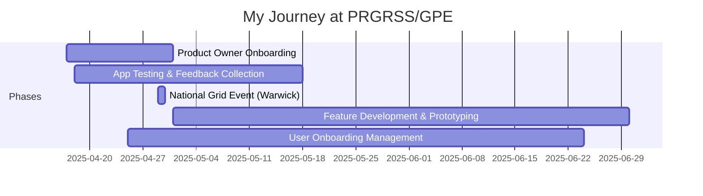

# PRGRSS / Global Purpose Enterprise (GPE)

## Overview

**Duration:** April 2025 - Present  
**Role(s):** Product Owner / App Developer  
**Location:** UK / Remote (with travel to events)  
**Organization Type:** Social Enterprise / Career Tech Startup

## Brief Description

PRGRSS is a mentorship app developed by Global Purpose Enterprise (GPE) that connects young professionals (mentees) with experienced industry mentors. The platform facilitates career guidance through scheduled video calls, messaging, and now job/internship listings. GPE runs various programs including career talks at major corporates like National Grid.

**Key People:**
- **André Spence** - Founder & CEO ("PRGRSS Boss")
- **Anthony** - COO, Global Purpose Enterprise Ltd
- **Hurera** - Lead Developer
- **Andie (Me)** - Product Owner

---

## My Journey

### Timeline

### Key Milestones

- **April 17, 2025**: Started as Product Owner replacing Valerie
- **April 18, 2025**: Introduced myself to the Career App group and began feedback collection
- **April 24, 2025**: Created first UI prototype for PRGRSS mentor-connect flow
- **April 25, 2025**: First user intake batch - managed onboarding of ~15 verified users
- **April 29, 2025**: Attended National Grid Warwick event - presented alongside team
- **May 7, 2025**: Developed comprehensive admin dashboard prototype
- **May 2025**: Built job listings feature prototype based on user feedback
- **Ongoing**: Managing user feedback, bug tracking, and development coordination

---

## Responsibilities & Contributions

### Product Management

- **User Feedback Collection & Analysis**
  - Description: Created and managed feedback forms, conducted individual mentee calls
  - Tools: Google Forms, individual calls, Slack
  - Impact: Gathered actionable insights that shaped product development priorities
  - Evidence: [Feedback Collection](evidence/feedback-collection.md)

- **User Onboarding Management**
  - Description: Managed controlled intake of new users to the platform
  - Process: Verified users, managed waitlist, coordinated with dev team
  - Impact: Successfully onboarded 50+ users while maintaining app stability

### Design & Prototyping

- **Mentor Connect Flow Prototype**
  - Description: Redesigned the mentor-mentee connection experience
  - Technologies: Lovable (prototype tool)
  - Prototype: [prgrss-mentor-connect.lovable.app](https://prgrss-mentor-connect.lovable.app/)
  - Impact: Provided visual direction for improved UX

- **Admin Dashboard Prototype**
  - Description: Designed comprehensive admin panel for better user management
  - Technologies: Lovable, Firebase backend understanding
  - Prototype: [prgrss-admin-dashboard-ui-47.lovable.app/jobs](https://prgrss-admin-dashboard-ui-47.lovable.app/jobs)
  - Impact: Provided blueprint for critical admin improvements

- **Job Listings Feature**
  - Description: Designed job/internship listings feature based on user feedback
  - Focus: Internships, graduate programmes, apprenticeships, spring weeks
  - Impact: Addressed key user need for career opportunities alongside mentorship

### Technical Coordination

- **Bug Tracking & Developer Coordination**
  - Description: Documented bugs, coordinated with lead developer Hurera
  - Tools: Jira, Slack, direct calls
  - Impact: Improved bug resolution and feature delivery

- **App Testing Coordination**
  - Description: Organized systematic testing across iOS and Android platforms
  - Approach: Individual mentee testing sessions, documented edge cases
  - Impact: Identified critical stability issues missed in previous testing

### Event Support

- **National Grid Warwick Event**
  - Description: Participated in career talk at National Grid for 200+ senior leaders
  - Date: April 29, 2025
  - Role: Team representative, presented app demo alongside André and Anthony
  - Impact: Promoted PRGRSS to corporate audience
  - Evidence: [National Grid Event](evidence/national-grid-event.md)

---

## Skills Demonstrated

### Product Management Skills

| Skill | Proficiency Level | Evidence |
|-------|-------------------|----------|
| User Research | Advanced | Feedback collection, mentee interviews |
| Product Roadmap | Intermediate | Feature prioritization with leadership |
| Stakeholder Management | Advanced | Coordination between users, devs, and leadership |
| Agile/Scrum | Intermediate | Sprint planning, daily standups |

### Technical Skills

| Skill | Proficiency Level | Evidence |
|-------|-------------------|----------|
| UI/UX Prototyping | Advanced | Multiple Lovable prototypes |
| Firebase/Backend Understanding | Intermediate | Bug analysis, admin panel work |
| QA/Testing | Advanced | Cross-platform testing coordination |
| Documentation | Advanced | Product reports, executive summaries |

### Soft Skills

| Skill | Proficiency Level | Evidence |
|-------|-------------------|----------|
| Communication | Advanced | Managing 100+ user WhatsApp group |
| User Support | Advanced | Individual mentee assistance |
| Cross-cultural Communication | Advanced | Working with diverse user base |
| Executive Communication | Intermediate | Brief bullet-point updates for CEO |

---

## Key Discussions & Decisions

### Messaging Workflow Design

Documented and helped refine the messaging limitation system:

> "If a meeting was completed within the last three days, both mentor and mentee receive an allocation of five messages per day. For meetings scheduled within the next seven days, both parties are limited to three messages per day."

### User Intake Strategy

Advocated for controlled growth:

> "We're working hard to give you all a fair chance! We really tightening things up with your feedback and let you all in one by one."

### Job Listings Feature

Facilitated user feedback that shaped the feature:

> Users requested: apprenticeships (degree and masters/level 3-5), internships, graduate programmes, spring weeks, MBA opportunities

### Communication Style Adaptation

Learned to adapt communication style for CEO:

> "Just prefer high level it's done type of messages... Hi Andre, I spoke to Hurera he is unblocking the 3 mins, I need to fix the data on this I'll do it today. Plain and simple to the point."

---

## Projects & Initiatives

### 1. PRGRSS App Improvement

**Duration:** April 2025 - Present  
**Role:** Product Owner  
**Status:** Ongoing

Key deliverables:
- User feedback forms and analysis
- Multiple UI/UX prototypes
- Bug tracking and resolution coordination
- Controlled user onboarding

### 2. Job Listings Feature

**Duration:** May 2025 - Present  
**Role:** Product Designer  
**Status:** In Development

Designed comprehensive job listings feature including:
- Apprenticeships (degree and masters/level 3-5)
- Internships
- Graduate programmes
- Social mobility internships
- Mentor-to-opportunity matching

### 3. Admin Dashboard Redesign

**Duration:** May 2025 - Present  
**Role:** Product Designer  
**Status:** In Development

Designed improved admin panel for:
- Better user management
- Visibility into platform metrics
- Simplified call management
- User credit handling

---

## Impact Summary

### Quantifiable Results

- **Users Onboarded**: 50+ new verified users managed
- **Feedback Collected**: Multiple rounds of structured feedback
- **Prototypes Created**: 3+ functional prototypes
- **Events Attended**: National Grid Warwick (200+ attendees)
- **Testing Sessions**: Multiple 1.5hr+ live testing sessions

### Qualitative Outcomes

- Established systematic feedback collection process
- Created visual direction for product improvements
- Built relationships with mentees and mentors
- Supported corporate partnership development

---

## Reflections

### What Went Well

- Strong relationship building with mentees through individual calls
- Effective prototype development that communicated vision clearly
- Successful adaptation to CEO's preferred communication style
- Valuable contributions to National Grid corporate event

### Challenges Faced

- Learning to provide concise updates (avoiding "long messages or VN")
- Managing expectations while app had stability issues
- Balancing personal responsibilities with work demands
- Context switching across multiple systems (Slack, WhatsApp, Jira)

### Key Takeaways

1. **Brevity matters**: Executives prefer "it's done" over detailed progress updates
2. **User relationships drive insights**: Individual conversations revealed more than forms alone
3. **Prototypes communicate**: Visual prototypes were more effective than written requirements
4. **Controlled growth**: Onboarding users gradually helped maintain quality
5. **Personal touch**: Managing 100+ users still benefits from individual attention

---

## Quotes & Evidence

> "You are a great man sir. Thank you for really trying"
> — André Spence, CEO

> "My name is Andie, stepping in as the new Product Owner for PRGRSS whilst Valerie moves on to her next challenge."
> — Introduction to the Career App group

> "Ooooh yes this is good!!!!"
> — Anthony, on the mentor-connect prototype

> "Job listings look straight forward and intuitive"
> — Anthony, on the admin dashboard prototype

> "On my train, very pleased to finally meet you all in person after so many years seeing only online! I am glad it lived up to all that I followed this year and it feels like a great place to have the highest impact I could have to date on the PRGRSS of our communities"
> — Post National Grid event reflection

---

## Related Documentation

- **Evidence**: [Feedback Collection](evidence/feedback-collection.md)
- **Evidence**: [National Grid Event](evidence/national-grid-event.md)
- **Evidence**: [Prototype Development](evidence/prototype-development.md)

---

## Artifacts & Links

- **Prototypes**:
  - [Mentor Connect Flow](https://prgrss-mentor-connect.lovable.app/)
  - [Admin Dashboard](https://prgrss-admin-dashboard-ui-47.lovable.app/jobs)
  - [Mentor Connect v2](https://prgrss-mentor-connect-02.lovable.app/)

- **Tools & Platforms**:
  - PRGRSS App (iOS/Android)
  - Jira for ticket management
  - Slack for developer coordination
  - Google Forms for feedback

- **Related Posts**:
  - [PRGRSS Instagram](https://www.instagram.com/p/DIUHRdDs9Hs/)

---

**Source**: 
- `raw-inputs/whatsapp-chats/unprocessed/2025_prgrss-andre-spence_one-on-one.txt`
- `raw-inputs/whatsapp-chats/unprocessed/2025_career-app-opportunities_group-chat.txt`
- `raw-inputs/whatsapp-chats/unprocessed/2025_gpe-anthony_one-on-one.txt`
- `raw-inputs/whatsapp-chats/unprocessed/2025-04_gpe-national-grid-warwick_event-planning.txt`

**Processed on**: 2026-01-28
