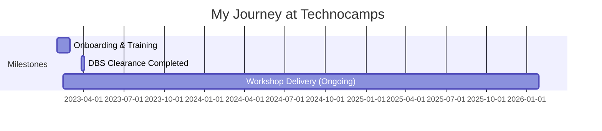

# Technocamps

## Overview

**Duration:** January 2023 - Present  
**Role(s):** Student Ambassador  
**Location:** University of South Wales (Treforest Campus) / Wales Schools  
**Organization Type:** University-Based STEM Education Programme

## Brief Description

Technocamps is a pan-Wales programme that delivers engaging workshops in schools to inspire young people about computer science, coding, and STEM careers. Based at Welsh universities, the programme uses trained ambassadors to deliver hands-on sessions using technologies like LEGO Mindstorms, Micro:bits, and various coding platforms.

---

## My Journey

### Timeline

### Key Milestones

- **January 2023**: Joined Technocamps as Student Ambassador
- **February 2023**: Completed DBS clearance process
- **February 2023**: First workshop delivery - Newport school session
- **February 2023**: Delivered workshop for Ukrainian refugee children in Cardiff
- **March 2023**: Completed office equipment relocation project
- **March 2023**: Received official Technocamps hoodie
- **April 2023**: Extended LEGO kit maintenance and organization work

---

## Responsibilities & Contributions

### Workshop Delivery

- **School Visits**
  - Description: Delivered coding and STEM workshops in schools across Wales
  - Technologies: LEGO Mindstorms, Micro:bits, Various coding platforms
  - Impact: Inspired young people about computer science and tech careers
  - Evidence: [Workshop Delivery](evidence/workshop-delivery.md)

- **Ukrainian Refugee Children Workshop**
  - Description: Delivered special workshop at Cardiff Atrium for Ukrainian refugee children
  - Location: ATRiuM Building, Cardiff (near Queen Street Station)
  - Impact: Provided engaging STEM education for displaced children

### Operations & Logistics

- **Office Equipment Relocation**
  - Description: Led relocation of all Technocamps equipment to new storage room
  - Tasks: Moving LEGO kits, filing cabinets, teaching materials, tablets
  - Collaboration: Worked with Eshan Fernando
  - Evidence: [Equipment Management](evidence/equipment-maintenance.md)

- **LEGO Kit Maintenance**
  - Description: Systematic sorting, organization, and charging of LEGO Mindstorms kits
  - Tasks: Inventory checking, identifying missing parts, charging tablets/bricks
  - Impact: Ensured workshop equipment was ready for deployment
  - Evidence: [Equipment Maintenance](evidence/equipment-maintenance.md)

### Administrative

- **DBS Clearance**
  - Description: Completed Disclosure and Barring Service check for working with children
  - Process: ID verification, document submission, certificate receipt
  - Status: Successfully completed March 2023

---

## Skills Demonstrated

### Technical Skills

| Skill | Proficiency Level | Evidence |
|-------|-------------------|----------|
| LEGO Mindstorms | Intermediate | Workshop delivery and kit maintenance |
| Micro:bits | Intermediate | Workshop delivery |
| STEM Education | Intermediate | Multiple school sessions |

### Soft Skills

| Skill | Proficiency Level | Evidence |
|-------|-------------------|----------|
| Workshop Facilitation | Intermediate | School sessions delivery |
| Equipment Management | Advanced | Kit maintenance and relocation |
| Team Collaboration | Advanced | Coordination with colleagues |
| Time Management | Advanced | Balancing coursework with ambassador duties |

---

## Team & Collaboration

### Key Colleagues

- **Laura Roberts**: Programme Coordinator - Main point of contact for scheduling
- **Rhys Thomas Williams**: Senior Ambassador - Workshop coordination and transport
- **Laura (Payroll)**: Administrative support and timesheet processing
- **Eshan Fernando**: Fellow Student Ambassador - Collaboration partner

### Working Relationship Highlights

- Regular coordination for workshop logistics and transport
- Proactive communication about availability and scheduling
- Flexibility in supporting various workshop types and locations

---

## Reflections

### What Went Well

- Successfully delivered workshops to diverse audiences including refugee children
- Took initiative on equipment maintenance during quieter periods
- Built strong working relationships with the Technocamps team
- Balanced academic commitments with ambassador responsibilities

### Challenges Faced

- Coordinating schedules around university coursework deadlines
- Transport logistics when workshops weren't near university campus
- Signal issues in certain university buildings affecting communication

### Key Takeaways

1. **Proactivity pays off**: Volunteering for tasks between workshops built trust and added value
2. **Communication is crucial**: Regular check-ins and availability updates kept things running smoothly
3. **Flexibility matters**: Being adaptable with schedules enabled more workshop participation
4. **Technical skills transfer**: STEM education requires both technical knowledge and teaching ability

---

## Impact Summary

### Quantifiable Results

- Multiple school workshops delivered across Wales
- 5+ LEGO kit boxes fully sorted and maintained
- Complete office equipment relocation completed
- DBS clearance successfully obtained

### Qualitative Outcomes

- Inspired young people about STEM careers
- Provided meaningful experience for Ukrainian refugee children
- Contributed to smooth operations of the Technocamps programme
- Demonstrated reliability as a student ambassador

---

## Quotes & Evidence

> "Fab thanks. Yes, have the hoodie!" 
> — Laura Roberts, after successful equipment relocation

> "Good luck, @Andie!"
> — Rhys Thomas Williams, before the refugee children workshop

> "@Andie completed about 5 boxes, they were quite messy, understandably so and lots had parts missing unfortunately"
> — Self-update on LEGO kit maintenance progress

---

## Related Documentation

- **Evidence**: [Workshop Delivery](evidence/workshop-delivery.md)
- **Evidence**: [Equipment Management](evidence/equipment-maintenance.md)

---

**Source**: `raw-inputs/whatsapp-chats/unprocessed/2025_technocamps-ambassadors_group-chat.txt`  
**Processed on**: 2026-01-28
