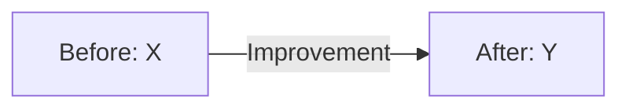

# Evidence: [Evidence ID or Name]

## Metadata

**Type:** [Code / Design / Metrics / Document / Certificate / Recognition / Artifact]  
**Date:** [Date created or achieved]  
**Organization:** [Link to organization]  
**Project:** [Link to project, if applicable]  
**Visibility:** [Public / Private / Redacted]

---

## Description

[Detailed description of what this evidence demonstrates about your skills, contributions, or achievements]

---

## Context

### Situation
[What was the context or situation that led to this evidence]

### Task/Challenge
[What needed to be accomplished or solved]

### Action
[What you specifically did]

### Result
[What was the outcome or impact]

---

## Evidence Content

### [For Code Samples]

<details>
<summary>View Code</summary>

```[language]
[Code snippet with comments explaining key decisions]
```

**Key Highlights:**
- [Technical decision or pattern used]
- [Interesting implementation detail]
- [Performance or quality consideration]

</details>

### [For Design Documents]

<details>
<summary>View Design</summary>

#### Design Overview
[Description of the design]

#### Diagrams

```mermaid
[Appropriate diagram type]
```

#### Key Design Decisions
- [Decision 1 and rationale]
- [Decision 2 and rationale]

</details>

### [For Metrics/Results]

**Baseline:**
- [Metric]: [Value before]

**Outcome:**
- [Metric]: [Value after]

**Improvement:**
- [Percentage or absolute improvement]



### [For Screenshots/Visuals]


**What This Demonstrates:**
- [Specific skill or achievement shown]
- [Specific skill or achievement shown]

### [For Certificates/Recognition]

**Credential:** [Name of certificate/award]  
**Issuer:** [Organization]  
**Verification:** [Link or ID]


---

## Skills Demonstrated

| Skill Category | Specific Skills |
|----------------|-----------------|
| Technical | [List of technical skills shown] |
| Leadership | [List of leadership skills shown] |
| Problem-Solving | [List of problem-solving approaches] |
| Communication | [List of communication skills shown] |

---

## Impact & Significance

### Technical Impact
[How this contributed technically]

### Business Impact
[How this affected business outcomes]

### Learning Impact
[What this taught you or how it expanded your capabilities]

---

## Validation & Verification

- **Peer Review:** [Comments from peers, if available]
- **Metrics:** [Measurable validation]
- **Recognition:** [Awards, mentions, or acknowledgments]

---

## Related Evidence

- [Link to related evidence]
- [Link to related project]
- [Link to related organization experience]

---

## Tags

`#[tag1]` `#[tag2]` `#[tag3]` `#[skill]` `#[technology]`
