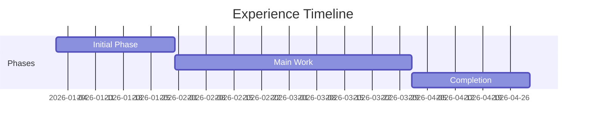

# Lessons Learned Template

Use this template to document lessons learned extracted from WhatsApp chats and other sources.

---

# [Title/Topic] - Lessons Learned

**Source**: [WhatsApp chat / Meeting / Project / etc.]
**Date Range**: [Start Date] - [End Date]
**Organization**: [Company/Team Name]
**Project/Context**: [Project name or context]

---

## Executive Summary

[Brief 2-3 sentence summary of the key lessons from this experience]

---

## Background & Context

### Situation
[Describe the situation or project context]

### My Role
[What was your role and responsibilities]

### Timeline

---

## What Went Well ✅

### [Success Area 1]
- **What happened**: [Description]
- **Why it worked**: [Explanation]
- **Evidence**: [Quote or reference from chat]
- **Takeaway**: [What to repeat in the future]

### [Success Area 2]
- **What happened**: [Description]
- **Why it worked**: [Explanation]
- **Evidence**: [Quote or reference]
- **Takeaway**: [What to repeat]

---

## Challenges Faced 🔴

### [Challenge 1]
- **The problem**: [Description of the challenge]
- **Impact**: [How it affected the work]
- **How it was resolved**: [Solution or workaround]
- **Evidence**: [Quote or reference from chat]
- **Prevention**: [How to avoid this in the future]

### [Challenge 2]
- **The problem**: [Description]
- **Impact**: [Effect]
- **How it was resolved**: [Solution]
- **Evidence**: [Reference]
- **Prevention**: [Future mitigation]

---

## Key Insights 💡

### Technical Insights
1. **[Insight 1]**: [Description and application]
2. **[Insight 2]**: [Description and application]

### Process Insights
1. **[Insight 1]**: [Description and application]
2. **[Insight 2]**: [Description and application]

### People/Communication Insights
1. **[Insight 1]**: [Description and application]
2. **[Insight 2]**: [Description and application]

---

## Recommendations for Future

### Do More Of
- [ ] [Action item 1]
- [ ] [Action item 2]
- [ ] [Action item 3]

### Do Less Of
- [ ] [Thing to avoid 1]
- [ ] [Thing to avoid 2]

### Start Doing
- [ ] [New practice 1]
- [ ] [New practice 2]

### Stop Doing
- [ ] [Practice to stop 1]
- [ ] [Practice to stop 2]

---

## Skills Demonstrated

| Skill | Evidence | Level |
|-------|----------|-------|
| [Skill 1] | [Reference from chat] | Beginner/Intermediate/Advanced |
| [Skill 2] | [Reference] | Level |
| [Skill 3] | [Reference] | Level |

---

## Impact Summary

### Quantifiable Results
- [Metric 1]: [Value]
- [Metric 2]: [Value]
- [Metric 3]: [Value]

### Qualitative Outcomes
- [Outcome 1]
- [Outcome 2]
- [Outcome 3]

---

## Quotes & Evidence

> "[Notable quote from the chat that demonstrates a key point]"
> — Context: [When/why this was said]

> "[Another relevant quote]"
> — Context: [Explanation]

---

## Related Documentation

- **Project**: [Link to project documentation]
- **Evidence**: [Link to evidence files]
- **Organization**: [Link to organization README]

---

## Reflection

[Personal reflection on this experience - what it meant for your growth, how it shaped your approach, etc.]

---

**Extracted from**: `raw-inputs/whatsapp-chats/[filename]`
**Processed on**: [Date]
**Last Updated**: [Date]
