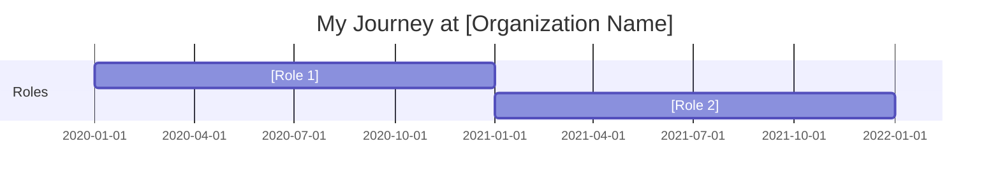
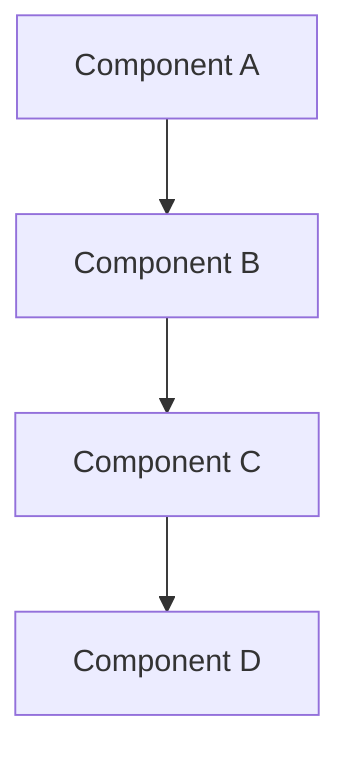
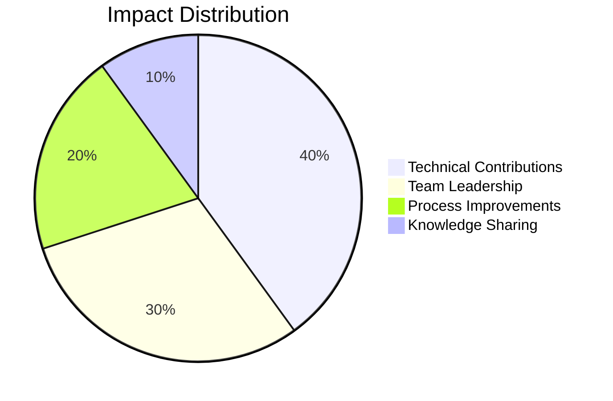

# [Organization Name]

## Overview

**Duration:** [Start Date] - [End Date or Present]  
**Role(s):** [Your role(s) at the organization]  
**Location:** [City, Country or Remote]  
**Organization Type:** [e.g., Startup, Enterprise, Non-profit, Government, etc.]

## Brief Description

[Provide a brief overview of the organization and its mission]

---

## My Journey

### Timeline



### Key Milestones

- **[Date]**: [Milestone description]
- **[Date]**: [Milestone description]
- **[Date]**: [Milestone description]

---

## Responsibilities & Contributions

### Technical Contributions

- **[Project/Initiative Name]**
  - Description: [Brief description]
  - Technologies: [List of technologies used]
  - Impact: [Measurable impact or outcome]
  - Evidence: [Link to evidence block or artifact]

### Socio-Technical Contributions

- **[Initiative Name]**
  - Description: [Brief description]
  - Stakeholders: [Who was involved]
  - Impact: [Organizational or cultural impact]
  - Evidence: [Link to evidence block or artifact]

---

## Skills Developed

### Technical Skills

| Skill | Proficiency Level | Evidence |
|-------|-------------------|----------|
| [Skill name] | [Beginner/Intermediate/Advanced/Expert] | [Link to evidence] |
| [Skill name] | [Beginner/Intermediate/Advanced/Expert] | [Link to evidence] |

### Soft Skills

| Skill | Description | Evidence |
|-------|-------------|----------|
| [Skill name] | [How you developed/applied it] | [Link to evidence] |
| [Skill name] | [How you developed/applied it] | [Link to evidence] |

---

## Evidence Blocks

### Evidence: [Evidence ID/Name]

**Type:** [Code Sample / Design Document / Metrics / Screenshot / Certificate / etc.]  
**Date:** [Date]  
**Description:** [What this evidence demonstrates]

<details>
<summary>View Evidence</summary>

[Embed or link to evidence here - code snippets, images, documents, etc.]

```[language if code]
[Content]
```

or


</details>

---

## Projects & Initiatives

### [Project Name]

**Duration:** [Start] - [End]  
**Role:** [Your role]  
**Team Size:** [Number of people]

#### Overview
[Project description]

#### Technical Architecture



#### Outcomes & Impact

- [Outcome 1]
- [Outcome 2]
- [Outcome 3]

#### Key Learnings

1. [Learning 1]
2. [Learning 2]
3. [Learning 3]

---

## Reflections

### What Went Well

[Reflect on positive experiences and successes]

### Challenges Overcome

[Describe challenges faced and how you overcame them]

### Key Takeaways

[Summarize the most important lessons learned]

---

## Metrics & Impact



### Quantifiable Achievements

- **[Metric Name]**: [Value/Percentage] - [Description]
- **[Metric Name]**: [Value/Percentage] - [Description]
- **[Metric Name]**: [Value/Percentage] - [Description]

---

## Artifacts & Links

- [Link to public work products, if applicable]
- [Link to blog posts or articles]
- [Link to presentations or talks]
- [Link to open source contributions]

---

## Related Experiences

- [Link to other organization folders or experiences]
- [Link to cross-organizational projects]
