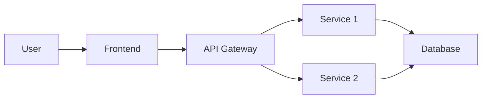
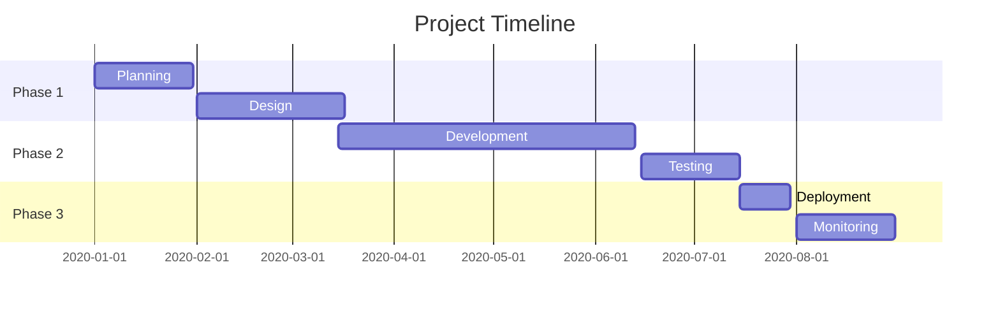
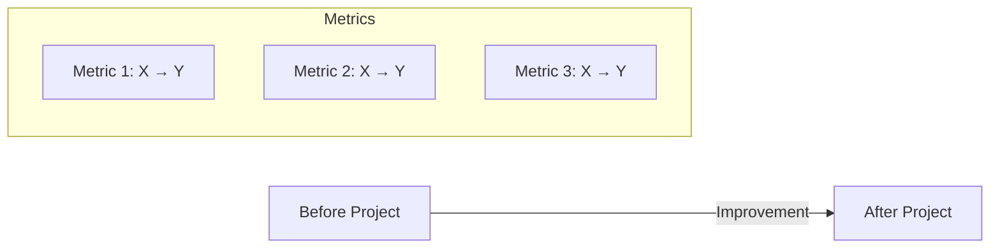
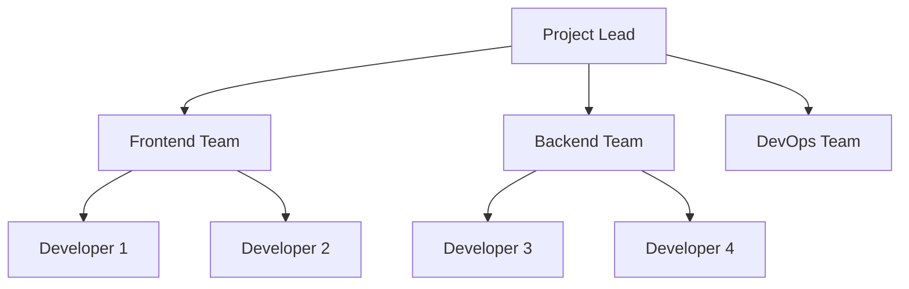

# [Project Name]

## Metadata

**Organization:** [Link to organization folder]  
**Duration:** [Start Date] - [End Date]  
**Role:** [Your role in the project]  
**Team Size:** [Number of team members]  
**Status:** [Completed / Ongoing / Archived]

---

## Executive Summary

[2-3 paragraph summary of the project, its goals, and outcomes]

---

## Problem Statement

### Background
[Context and background of the problem]

### Business Challenge
[What business problem was being solved]

### Technical Challenge
[What technical challenges needed to be addressed]

---

## Solution

### Approach
[Describe the approach taken to solve the problem]

### Architecture



### Technology Stack

| Category | Technologies |
|----------|--------------|
| Frontend | [List technologies] |
| Backend | [List technologies] |
| Database | [List technologies] |
| Infrastructure | [List technologies] |
| Tools & Services | [List technologies] |

---

## My Contributions

### Technical Contributions

#### [Contribution Category 1]
- [Specific contribution]
- [Specific contribution]
- [Specific contribution]

#### [Contribution Category 2]
- [Specific contribution]
- [Specific contribution]

### Leadership & Collaboration
- [Leadership activity]
- [Collaboration activity]

---

## Implementation Timeline



### Key Milestones

- **[Date]**: [Milestone name and description]
- **[Date]**: [Milestone name and description]
- **[Date]**: [Milestone name and description]

---

## Outcomes & Impact

### Business Impact
- [Business metric/outcome]
- [Business metric/outcome]

### Technical Impact
- [Technical improvement/outcome]
- [Technical improvement/outcome]

### User Impact
- [User-facing benefit]
- [User-facing benefit]

### Metrics



---

## Technical Deep Dive

### [Component/Feature 1]

**Purpose:** [What it does]

**Implementation:**

```[language]
// Example code snippet
[Code that demonstrates key implementation]
```

**Key Decisions:**
- [Decision and rationale]
- [Decision and rationale]

### [Component/Feature 2]

**Purpose:** [What it does]

**Implementation:**

```[language]
// Example code snippet
[Code that demonstrates key implementation]
```

---

## Challenges & Solutions

| Challenge | Solution | Outcome |
|-----------|----------|---------|
| [Challenge description] | [How it was solved] | [Result] |
| [Challenge description] | [How it was solved] | [Result] |

---

## Learnings & Growth

### Technical Learnings
1. [Learning about specific technology or approach]
2. [Learning about specific technology or approach]
3. [Learning about specific technology or approach]

### Process Learnings
1. [Learning about team processes or methodologies]
2. [Learning about team processes or methodologies]

### Personal Growth
1. [How this project contributed to your growth]
2. [How this project contributed to your growth]

---

## Evidence

### Code Samples

<details>
<summary>View Code Sample: [Brief Description]</summary>

```[language]
[Code snippet]
```

</details>

### Screenshots/Diagrams


### Documentation

- [Link to technical documentation]
- [Link to architecture decisions]
- [Link to API documentation]

---

## Team & Collaboration

### Team Structure



### My Role in Team Dynamics
[Describe how you worked with the team, your leadership or collaborative contributions]

### Cross-functional Collaboration
[Describe work with other teams or departments]

---

## Future Considerations

### What I Would Do Differently
[Reflections on potential improvements]

### Potential Enhancements
[Ideas for future enhancements if the project continued]

---

## Related Projects
- [Link to related project]
- [Link to follow-up work]
