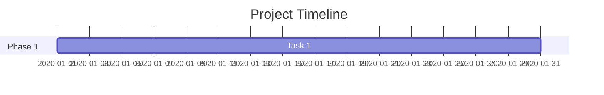
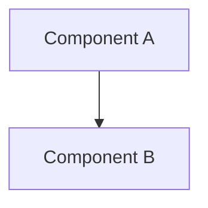
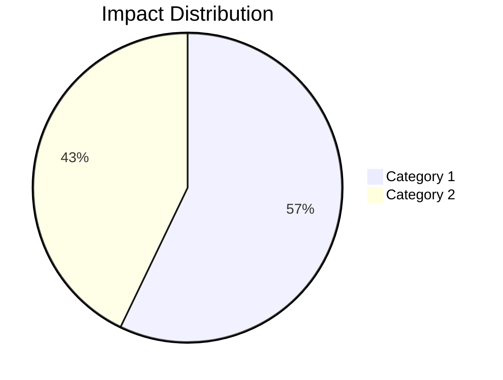
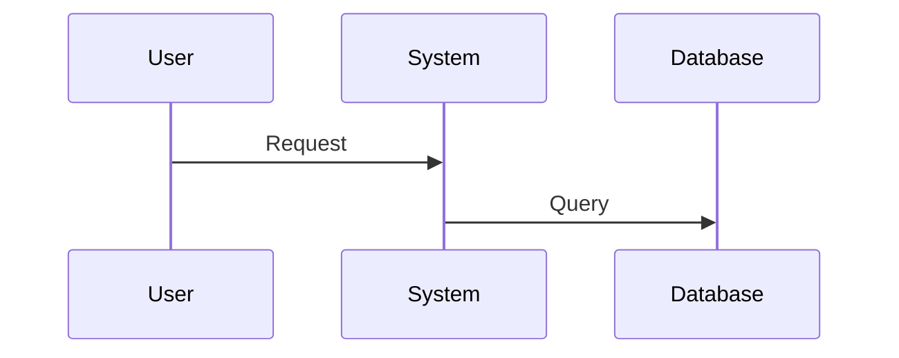

# Documentation Templates Guide

This folder contains templates to help you document your professional journey across different organizations in a consistent and comprehensive manner.

## Available Templates

### 1. Organization README Template
**File:** `ORGANIZATION_README_TEMPLATE.md`

Use this template to create the main documentation for each organization you've worked with.

**When to use:**
- Starting to document a new organization
- Creating an overview of your entire experience at a company

**Key Features:**
- Timeline visualization with Mermaid charts
- Evidence blocks for artifacts and proof of work
- Structured sections for technical and socio-technical contributions
- Skills tracking with proficiency levels
- Project listings and reflections

### 2. Project Template
**File:** `PROJECT_TEMPLATE.md`

Use this template to document individual projects or initiatives within an organization.

**When to use:**
- Documenting a significant project or initiative
- Creating detailed technical documentation of your work
- Showcasing specific contributions and outcomes

**Key Features:**
- Technical architecture diagrams
- Implementation timelines with Gantt charts
- Technology stack documentation
- Impact metrics and outcomes
- Code samples and technical deep dives

### 3. Evidence Template
**File:** `EVIDENCE_TEMPLATE.md`

Use this template to document specific evidence of your work, skills, and achievements.

**When to use:**
- Storing code samples with context
- Documenting certifications and awards
- Recording metrics and measurable outcomes
- Preserving design documents and decisions

**Key Features:**
- STAR format (Situation, Task, Action, Result)
- Multiple evidence types (code, metrics, documents, certificates)
- Skills mapping
- Impact documentation
- Tagging system for easy discovery

### 4. Lessons Learned Template
**File:** `LESSONS_LEARNED_TEMPLATE.md`

Use this template to document insights and lessons extracted from experiences, chats, and projects.

**When to use:**
- Processing WhatsApp chat exports about work
- Documenting post-project retrospectives
- Capturing insights from challenging experiences
- Recording what worked and what didn't

**Key Features:**
- Structured sections for successes and challenges
- Do more/do less/start/stop recommendations
- Skills demonstrated with evidence
- Quote extraction for key insights
- Integration with raw-inputs processing workflow

## Recommended Folder Structure

```
life-experiences-repo/
├── README.md (main overview)
├── organizations/
│   ├── [organization-name-1]/
│   │   ├── README.md (from ORGANIZATION_README_TEMPLATE.md)
│   │   ├── projects/
│   │   │   ├── [project-1].md (from PROJECT_TEMPLATE.md)
│   │   │   ├── [project-2].md
│   │   │   └── ...
│   │   ├── evidence/
│   │   │   ├── [evidence-1].md (from EVIDENCE_TEMPLATE.md)
│   │   │   ├── [evidence-2].md
│   │   │   └── ...
│   │   └── assets/
│   │       ├── images/
│   │       ├── documents/
│   │       └── certificates/
│   ├── [organization-name-2]/
│   │   └── ... (same structure)
│   └── ...
├── raw-inputs/
│   ├── README.md (raw inputs guide)
│   └── whatsapp-chats/
│       ├── README.md (WhatsApp processing guide)
│       ├── unprocessed/      # Drop chat exports here
│       ├── processed/        # Completed chats
│       ├── by-project/       # Organized by project
│       ├── by-date/          # Organized by date
│       └── media/            # Images and documents
└── templates/
    ├── README.md (this file)
    ├── ORGANIZATION_README_TEMPLATE.md
    ├── PROJECT_TEMPLATE.md
    ├── EVIDENCE_TEMPLATE.md
    └── LESSONS_LEARNED_TEMPLATE.md
```

## How to Use These Templates

### Step 1: Create Organization Folder

```bash
mkdir -p organizations/[organization-name]
mkdir -p organizations/[organization-name]/projects
mkdir -p organizations/[organization-name]/evidence
mkdir -p organizations/[organization-name]/assets/{images,documents,certificates}
```

### Step 2: Copy and Customize Organization README

```bash
cp templates/ORGANIZATION_README_TEMPLATE.md organizations/[organization-name]/README.md
```

Then edit the file and replace all placeholders (in square brackets) with your actual information.

### Step 3: Document Projects

For each major project:

```bash
cp templates/PROJECT_TEMPLATE.md organizations/[organization-name]/projects/[project-name].md
```

### Step 4: Add Evidence

For each piece of evidence:

```bash
cp templates/EVIDENCE_TEMPLATE.md organizations/[organization-name]/evidence/[evidence-id].md
```

### Step 5: Link Everything Together

- Link projects from the organization README
- Link evidence from both projects and organization README
- Use relative paths for easy navigation

## Chart and Diagram Support

All templates include support for Mermaid charts, which are rendered by GitHub and many Markdown viewers.

### Available Chart Types

1. **Gantt Charts** - For timelines


2. **Flowcharts/Graphs** - For architectures and relationships


3. **Pie Charts** - For distributions


4. **Sequence Diagrams** - For interactions


### Additional Chart Resources

- [Mermaid Live Editor](https://mermaid.live/) - Test your charts
- [Mermaid Documentation](https://mermaid-js.github.io/mermaid/)

## Evidence Blocks Best Practices

### 1. Use Details/Summary for Large Content

```markdown
<details>
<summary>View Code Sample</summary>

\`\`\`python
# Your code here
\`\`\`

</details>
```

This keeps your documentation clean while preserving all details.

### 2. Always Provide Context

Don't just show evidence; explain:
- Why it matters
- What problem it solved
- What skills it demonstrates
- What the impact was

### 3. Use the STAR Format

For each evidence block:
- **Situation:** What was the context?
- **Task:** What needed to be done?
- **Action:** What did you do?
- **Result:** What was the outcome?

### 4. Include Metrics When Possible

Quantify your impact:
- Performance improvements (e.g., "Reduced load time by 50%")
- Scale achievements (e.g., "Handled 1M+ requests/day")
- Team impact (e.g., "Led team of 5 engineers")

### 5. Protect Sensitive Information

Before adding evidence:
- Remove proprietary information
- Redact sensitive data
- Get permission if needed
- Mark clearly if the evidence is redacted

## Tips for Effective Documentation

### 1. Start Small
Don't try to document everything at once. Start with:
- One organization
- One major project
- A few key pieces of evidence

### 2. Be Consistent
Use the same format across all your documentation for easy navigation.

### 3. Update Regularly
Set aside time regularly (monthly or quarterly) to:
- Add new experiences
- Update ongoing projects
- Refine existing documentation

### 4. Cross-Reference
Create a web of connections:
- Link projects to organizations
- Link evidence to projects
- Link related experiences together

### 5. Use Tags
Tag your evidence for easy discovery:
- Technology tags (e.g., `#python`, `#react`)
- Skill tags (e.g., `#leadership`, `#architecture`)
- Type tags (e.g., `#code-sample`, `#metrics`)

## Naming Conventions

### Organization Folders
Use lowercase with hyphens:
- `acme-corp`
- `tech-startup-xyz`
- `nonprofit-organization`

### Project Files
Use descriptive lowercase with hyphens:
- `payment-processing-redesign.md`
- `microservices-migration.md`
- `mobile-app-launch.md`

### Evidence Files
Use descriptive names with type prefix:
- `code-authentication-system.md`
- `metrics-performance-improvement.md`
- `cert-aws-solutions-architect.md`
- `design-api-gateway-architecture.md`

## Example Links

To link to different parts of your documentation:

```markdown
<!-- Link to organization -->
[My work at Acme Corp](../organizations/acme-corp/README.md)

<!-- Link to project -->
[Payment Processing Project](../organizations/acme-corp/projects/payment-processing.md)

<!-- Link to evidence -->
[Code Sample: Auth System](../organizations/acme-corp/evidence/code-auth-system.md)

<!-- Link to image -->

```

## Getting Help

If you need help with:
- Markdown syntax: [GitHub Markdown Guide](https://guides.github.com/features/mastering-markdown/)
- Mermaid charts: [Mermaid Documentation](https://mermaid-js.github.io/mermaid/)
- Structuring your content: Review the example organization folder

---

**Remember:** The goal is to create a comprehensive, navigable record of your professional journey that demonstrates your growth, skills, and impact over time.
